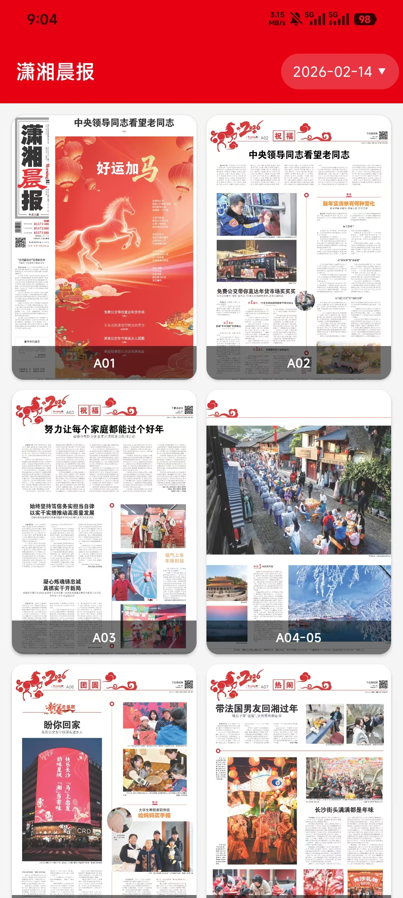

# 潇湘晨报 - XiaoXiangNews

一款基于 Android 原生开发的潇湘晨报电子报阅读应用，提供高清 PDF 报纸浏览体验。

## 效果展示

| 报纸列表 | PDF 阅读 |
|:---:|:---:|
|  |  |

## 功能特性

- **报纸浏览** — 以网格缩略图形式展示每日各版报纸
- **高清 PDF 阅读** — 下载并渲染 PDF 原版报纸，支持双指缩放与平移
- **横向翻页** — 左右滑动快速切换不同版次
- **日期选择** — 内置日期选择器，仅允许选择有报纸的有效日期
- **智能加载** — 每次打开自动加载最新一期
- **离线缓存** — PDF 文件磁盘缓存 + Bitmap 内存缓存，本地限制200MB缓存，超出后自动清理
- **后台预加载** — 打开报纸后自动在后台预下载所有版次 PDF

## 技术栈

| 类别 | 技术 |
|------|------|
| 语言 | Kotlin |
| UI 框架 | Jetpack Compose |
| 架构 | MVVM |
| 网络 | Retrofit + OkHttp |
| 图片加载 | Coil |
| PDF 渲染 | Android PdfRenderer |
| 导航 | Navigation Compose |
| 最低版本 | Android 7.0 (API 24) |

## 项目结构

```
app/src/main/java/com/xxcb/news/
├── MainActivity.kt                  # 入口 Activity + 导航配置
├── data/
│   ├── api/
│   │   ├── NewspaperApi.kt          # Retrofit API 接口定义
│   │   └── RetrofitClient.kt       # Retrofit 客户端单例
│   ├── cache/
│   │   └── PdfCache.kt             # PDF 磁盘缓存 + Bitmap 内存缓存
│   ├── model/
│   │   └── NewspaperModels.kt       # 数据模型
│   └── repository/
│       └── NewspaperRepository.kt   # 数据仓库层
└── ui/
    ├── screen/
    │   ├── NewspaperScreen.kt       # 主页（报纸网格 + 日期选择）
    │   └── PdfViewerScreen.kt       # PDF 阅读页（翻页 + 缩放）
    ├── theme/                       # Material3 主题配置
    └── viewmodel/
        └── NewspaperViewModel.kt    # ViewModel 状态管理
```

## API 接口

基础域名：`https://xxcb.cn`

| 接口 | 说明 |
|------|------|
| `GET /api/newspaper/pdfs/get?date=YYYY-MM-DD` | 获取指定日期的报纸数据 |
| `GET /api/newspaper/valid/dates/get?year=YYYY` | 获取指定年份的有效日期列表 |
| `GET /api/newspaper/all/valid/dates/get` | 获取所有有效日期列表 |

## 构建与运行

1. 使用 Android Studio (Ladybug 或更高版本) 打开项目
2. 等待 Gradle 同步完成
3. 连接 Android 设备或启动模拟器
4. 点击 Run 运行应用

## 环境要求

- Android Studio Ladybug+
- JDK 11+
- Android SDK 35
- Gradle 8.8+

## License

本项目仅供学习交流使用。报纸内容版权归潇湘晨报所有。
